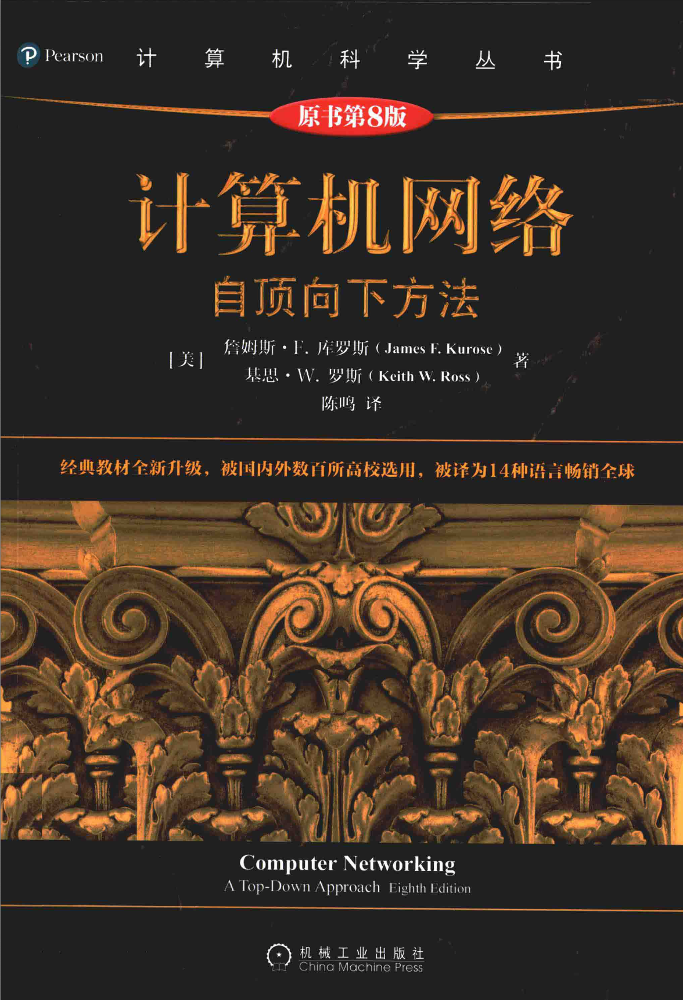

# Computer-Networking-8th
计算机网络第八版中英文版+习题

计算机网络：自顶向下方法（原书第8版）

作者: [美] James F·Kurose / Keith W. Ross  
出版社: 机械工业出版社  
副标题: 自顶向下方法  
原作名: Computer Networking: A Top-Down Approach  
译者: 陈鸣  
出版年: 2022-8

中文版书籍下载地址：
https://www.123684.com/s/IJzlTd-rIQuA
提取码:VGmm

